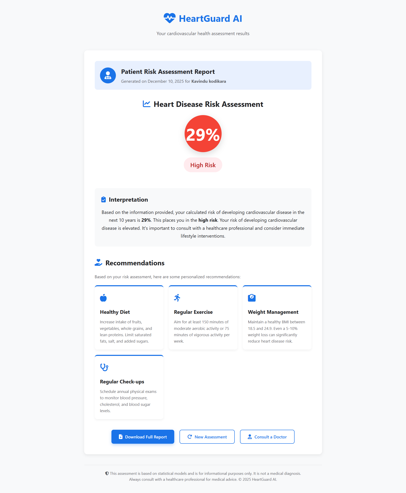

# Heart Disease Prediction Web App

**Heart Disease Prediction Web App** is a small end-to-end project that demonstrates a machine learning pipeline (training → model export) and a simple Flask web front-end for predicting 10-year heart disease risk. It was built as a portfolio piece to show to recruiters and hiring managers.

---

## Project overview

* **Stack:** Python, scikit-learn, Flask, HTML/CSS, joblib
* **ML model:** `LinearRegression` (trained with scikit-learn)
* **Purpose:** Given a small set of patient features (gender, age, total cholesterol, HDL, smoking status, blood pressure medication, diabetes), the app returns a predicted heart disease risk percentage and shows tailored recommendations.
* **Usage:** Suitable as a demo/portfolio project. Not intended for clinical use.

---

## Repository structure

```
heart-disease-webapp/
├─ data/
│  └─ cardio_dataset.csv       # Original dataset used for training
├─ models/
│  └─ heart_model.sav          # Trained model (joblib dump)
├─ notebooks/
│  └─ model_training.ipynb     # Jupyter notebook used for training the model
├─ templates/
│  ├─ patient_details.html     # Input form page
│  └─ patient_results.html     # Results page 
├─ webapp.py                   # Flask application
├─ requirements.txt            # Python dependencies
└─ README.md
```


---

## What I built

This project shows a complete pipeline: data → model → web UI. I trained a `LinearRegression` model on a cardio dataset and exported it with `joblib`. The Flask app loads the model and exposes a form-based UI that accepts patient data, runs a prediction, and displays an interpretable result with recommendations.


---

## Quick demo (screenshots)




---

## Setup & run (Windows / macOS / Linux)

### 1. Clone the repo

```bash
git clone https://github.com/kavindu-kodikara/HeartGuard.git
cd HeartGuard
```

### 2. Create a Python virtual environment

**Windows**

```powershell
python -m venv venv
venv\Scripts\activate
```

**macOS / Linux**

```bash
python3 -m venv venv
source venv/bin/activate
```

### 3. Install dependencies

Make sure `requirements.txt` exists. If not, create it with the dependencies listed below.

```bash
pip install -r requirements.txt
```

**Suggested `requirements.txt`**

```
flask
scikit-learn
joblib
pandas
numpy
```

### 4. Add the trained model (or train it locally)

Option A — Use the included model

* `models/heart_model.sav` is already in the repo, you can run the app immediately.

Option B — Train the model locally 

* Open `notebooks/model_training.ipynb` or run a short training script that reproduces your notebook. Example training script:

```python
# train_model.py (example)
import pandas as pd
from sklearn.model_selection import train_test_split
from sklearn.linear_model import LinearRegression
import joblib

# adjust the path to your dataset
dataset = pd.read_csv('data/cardio_dataset.csv').values
X = dataset[:, 0:7]
y = dataset[:, 7]
X_train, X_test, y_train, y_test = train_test_split(X, y, test_size=0.1, random_state=42)
model = LinearRegression()
model.fit(X_train, y_train)
joblib.dump(model, 'models/heart_model.sav')
print('Saved model: models/heart_model.sav')
```

Run:

```bash
python train_model.py
```

### 5. Launch the Flask app

```bash
python webapp.py
```

Open your browser at `http://127.0.0.1:5000/` and test the form.

---

## Notes about the ML model & dataset

* The notebook in `notebooks/model_training.ipynb` uses a `LinearRegression` model. Linear regression is usually for continuous targets; if your target is binary (disease/no disease), a classification model (Logistic Regression, RandomForestClassifier, etc.) would be a more appropriate choice.
* The dataset path used in the notebook is `../data/cardio_dataset.csv`; please ensure the dataset is present and the indexing of columns matches your features and target.
* The model saved with `joblib.dump` is loaded by the Flask app with `joblib.load('models/heart_model.sav')` — if the file path differs, update `webapp.py` accordingly.

---


## Disclaimer
**This project is part of my professional portfolio. You’re welcome to reference it, but please credit me if you reuse or adapt any part of it.**

## License
This project is licensed under the [MIT License](LICENSE).
